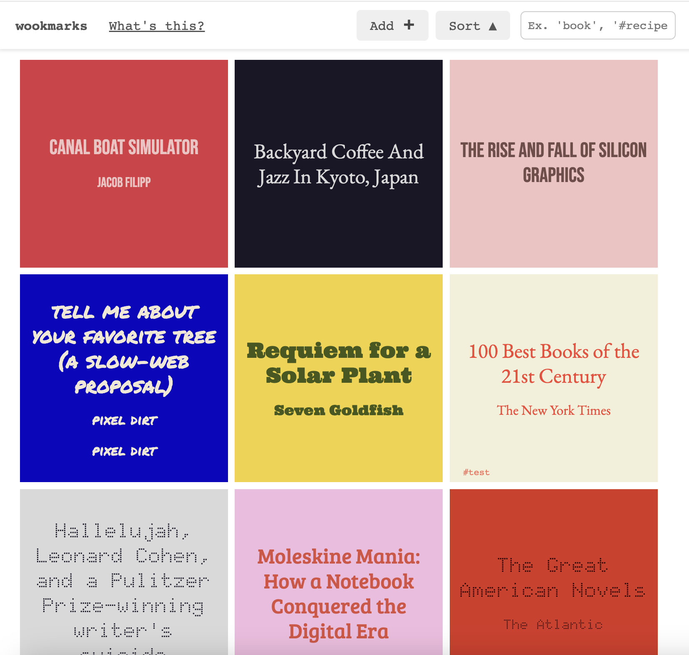

 

# woomarks (AT Protocol Edition)
woomarks is an app that lets you save bookmarks to your AT Protocol Personal Data Server (PDS). 



This version stores bookmarks directly on the AT Protocol network using a custom lexicon, making your bookmarks portable across the decentralized web.


## Features
- Add/Delete bookmarks stored on AT Protocol
- Search and filter by tags
- Decentralized storage on your Personal Data Server
- Bookmarklet support for easy saving
- Responsive design with dynamic colors and fonts
- No backend server needed - connects directly to AT Protocol
- Open lexicon format for interoperability

## Prerequisites
- An AT Protocol account (e.g., Bluesky account)
- A Personal Data Server (PDS) that supports custom lexicons

## AT Protocol Integration
This app uses the standard `community.lexicon.bookmarks.bookmark` lexicon from [lexicon.community](https://github.com/lexicon-community/lexicon) to store bookmark records on your PDS. Each bookmark contains:
- URI (required) - The bookmarked URL
- Title (optional) - The title of the bookmarked page
- Tags (optional array) - Organizational tags
- Creation timestamp

Using the community standard lexicon means your bookmarks are:
- Interoperable with other AT Protocol bookmark apps
- Portable across different implementations
- Following established community standards
- Owned and controlled by you on your PDS

## Installation

1. **Deploy the App**
   - Copy the contents of this repository to a web server
   - Or use a static hosting service like GitHub Pages, Netlify, or Vercel

2. **Login with AT Protocol**
   - Open the app in your browser
   - Enter your AT Protocol handle (e.g., `username.bsky.social`)
   - Enter your app password (generate one in your AT Protocol client)
   - Click Login

3. **Start Bookmarking**
   - Use the Add button to save new bookmarks
   - Tag and organize your bookmarks
   - Search and filter your collection

## Bookmarklet Setup
Create a bookmarklet for easy saving:
- Create a new bookmark in your browser
- Set the name to "Save to woomarks"
- Use this as the URL:
```javascript
javascript:(function(){
const url = encodeURIComponent(window.location.href);
const title = encodeURIComponent(document.title);
window.open(`https://YOURDOMAINHERE.com/?title=${title}&url=${url}`, '_blank');
})();
```


## Design
 This design is inspired by Pocket's UI, which was very good for showing a list of articles to read later. Native bookmarking feels more utilitarian, suited for recurrent links, woomarks is more suited for read later links.

## Philosophy
I had all my bookmarks in Pocket and it's shutting down. Same thing happened to del.icio.us. So I decided to keep the web cool and decentralized by building on AT Protocol. Now your bookmarks live on a decentralized network that you control, not in some company's database that might disappear.

## License
Do whatever you want with this, personal or commercial. No warranties are given.

Attribution required in a footer link, legible size and colour, with the text "Made with woomarks" and a link to `https://github.com/earlyriser/woomarks`. 
"Based on woomarks" is also a valid wording if substantial change was done.